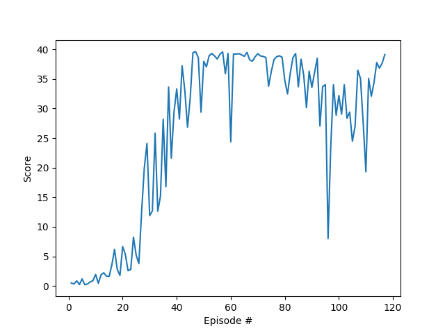

# Solving Reacher Environment with Deep Deterministic Policy Gradients

## Overview

This report describes my solution to the Reacher environment as part of 
the Continuous Control project from Udacity Deep Reinforcement Learning Nanodegree. 
It solves the environment with one agent and achieves an average score of +30 over consecutive 100 episodes after 117 episodes.

My solution implements a Deep Deterministic Policy Gradients (DDPG) algorithm as proposed 
by Lillicrap, Timothy P., et al. "Continuous control with deep reinforcement learning."

In addition to the original paper I also studied the following implementations of the algorithm:

- [Udacity Deep Reinforcement Learning Nanodegree repository](https://github.com/udacity/deep-reinforcement-learning) 
contains DDPG implementations for other environments
- [DeepRL repository](https://github.com/ShangtongZhang/DeepRL) provides a general implementation of DDPG in a modular way

The implementation is done in Python using PyTorch. 

## Learning Algorithm

The DDPG algorithm is implemented in the [ddpg.py](ddpg.py) file. 
Learning of continuous actions requires an actor (`Actor` class) and a critic (`Critic` class) model.
The actor model learns to predict an action vector while the critic model learns Q values for state-action pairs.
DDPG uses experience replay (`Replay` class) to sample batches of uncorrelated experiences to train on. 
It also distinguishes between online and target models for both actor and critic, similar to fixed Q-targets and double DQN technique.
Online models are updated by minimizing loses while target models are updated through soft update, 
i.e. online model parameters values are partially transferred to target models. 
This helps to avoid overestimation of Q-values and makes the training more stable.

The core of DDPG algorithm is implemented in the `Agent` class. 
The `act` method generates an action for the given state with the online actor model.
An important aspect is the noise added to the actions to allow exploration of the the action space.
The noise is generated through the Ornstein–Uhlenbeck process, 
which is a stochastic process that is both Gaussian and Markov, drifting towards the mean in long-term.
The `learn` method implements updates to the models and has the following flow:

1. A batch of experiences is sampled from the replay buffer.
2. Update online critic model
    1. Predict actions for the next states with the target actor model
    2. Compute Q-values for the next states and actions with the target critic model
    3. Compute target Q-values for the current states and actions using the Bellman equation
    4. Compute Q values for the current states and actions with the online critic model
    5. Use the target and online Q-values to compute the loss
    6. Minimize the loss for the online critic model
3. Update online actor model
    1. Predict actions for current states from the online actor model
    2. Compute Q-values with the online critic model
    3. Use the Q-values to compute the loss
    4. Minimize the loss for the online actor model
4. Soft update of the target critic and actor models

Training of the agent is implemented in the `run` function, which has the following flow:

1. Every timestep a state of the environment is observed
2. The agent selects an action
3. The environment provides the next state, the reward received and the information whether the episode is completed.
4. State, action, next state and the reward constitute the experience that the agent adds to its replay buffer.
5. When enough experiences are collected the agent learns as described above.
 
## Network architecture

DDPG uses two network architectures, one for actor and one for critic.
The actor network maps state to action and has the following structure:
 
1. State input (33 units)
2. Hidden layer (256 units) with ReLU activation and batch normalization
3. Hidden layer (256 units) with ReLU activation and batch normalization
4. Action output (4 units) with tanh activation

The critic network maps state and action to Q value and has the following structure:
1. State input (33 units)
2. Hidden layer (256 nodes) with ReLU activation and batch normalization
3. Action input (4 units)
4. Hidden layer with inputs from layers 2 and 3 (256 nodes) with ReLU activation and batch normalization
5. Q-value output (1 node)

## Hyperparameters

Values for the hyperparameters were obtained from the original paper and reference implementations 
and then tweaked based on the results of multiple runs.
One of the most important parameters to get right was the standard deviation of the Ornstein–Uhlenbeck process (sigma). 
It controls the exploration-exploitation trade-off.
The reference value of 0.2 was too high for the environment, resulting in extreme actions and no learning. 
Getting it down to 0.05 allowed for efficient learning.

Another important parameter for boosting the training is the learning rate for actor and critic models.
Values that are too high prevented the agent from achieving high scores while low values slowed down the training process.
Here is the complete list of hyperparamters with their values after turning.

| Hyperparameter | Value | Description |
|---|---:|---|
| Replay buffer size | 1e6 | Maximum size of experience replay buffer |
| Replay batch size | 128 | Number of experiences sampled in one batch |
| Actor hidden units | 256, 256 | Number of units in hidden layers of the actor model |
| Actor critic units | 256, 256 | Number of units in hidden layers of the critic model |
| Actor learning rate | 3e-4 | Controls parameters update of the online actor model |
| Critic learning rate | 3e-4 | Controls parameters update of the online critic model |
| Target update mix | 1e-3 | Controls parameters update of the target actor and critic models |
| Discount factor | 0.99 | Discount rate for future rewards |
| Ornstein-Uhlenbeck, mu | 0 | Mean of the stochastic  process|
| Ornstein-Uhlenbeck, theta | 0.15 | Parameter of the stochastic process |
| Ornstein-Uhlenbeck, sigma | 0.05 | Standard deviation of the stochastic process |
| Max episodes | 1000 | Maximum number of episodes to train |
| Max steps | 1e6 | Maximum number of timesteps per episode |

## Results

The agent was able to solve the environment by achieving score above 30 over 100 consecutive episodes after 117 episodes.
Starting from 40 episodes, the agent was consistently reaching scores close to 40. 
There are a couple of drops during the training with fast recovery after several episodes.

Plot of the scores:

## Future work

1. A more systematic way of searching of optimal values for hyperparameters, 
e.g. grid search, random search, bayesian optimization or genetic algorithm
2. Better control of the exploration-exploitation trade-off by implementing a decreasing schedule for the sigma parameter of the
Ornstein-Uhlenbeck process

